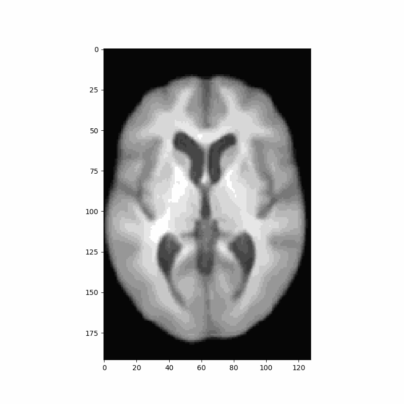

# Conditional VAE for 3D Medical Imaging
A Res-Net Style VAE for 3D Imaging data utilizing lightweight depth-wise separable convolutions.



## Training Examples
```
python train_vae.py -mn test_run --dataset_root #path to dataset root#
```

```
python train_vae.py -mn test_run --load_checkpoint --dataset_root #path to dataset root#
```

```
python train_vae.py -mn test_run --latent_channels 128 --block_widths 1 2 4 8 --ch_multi 64 --dataset_root #path to dataset root#
```


```
python train_vae.py -mn test_run --image_size 128 --block_widths 1 2 4 4 8 --dataset_root #path to dataset root#
```

```
python train_vae.py -mn test_run --image_size 128 --deep_model  --latent_channels 64 --dataset_root #path to dataset root#
```
