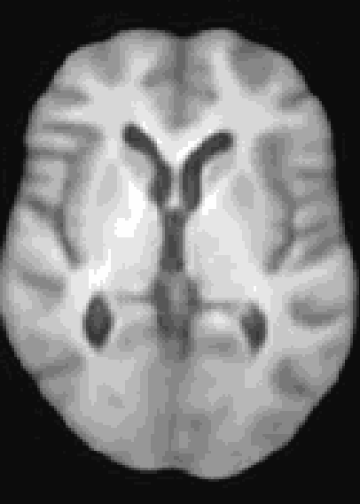

# Conditional VAE for 3D (Brain) Imaging
A Res-Net Style CVAE for 3D Imaging data utilizing lightweight depth-wise separable convolutions. The data set I used for this repository was synthesized from the pre-trained diffusion model from [Pinaya et al. (2022)](https://arxiv.org/abs/2209.07162). However, any 3D data would work here.

At the moment, the model conditions the latent space of brain volume and ventricle volume. Here, we see an example of interpolating the ventricle volume of a specific brain reconstruction from 50 ml to 150 ml:

<div align="center">
   
</div>

## Training Examples

```
python train_vae.py -mn test_run --image_size 128 --deep_model --latent_channels 128 --block_widths 1 2 4 8 --ch_multi 64 --dataset_root #path to dataset root#
```

